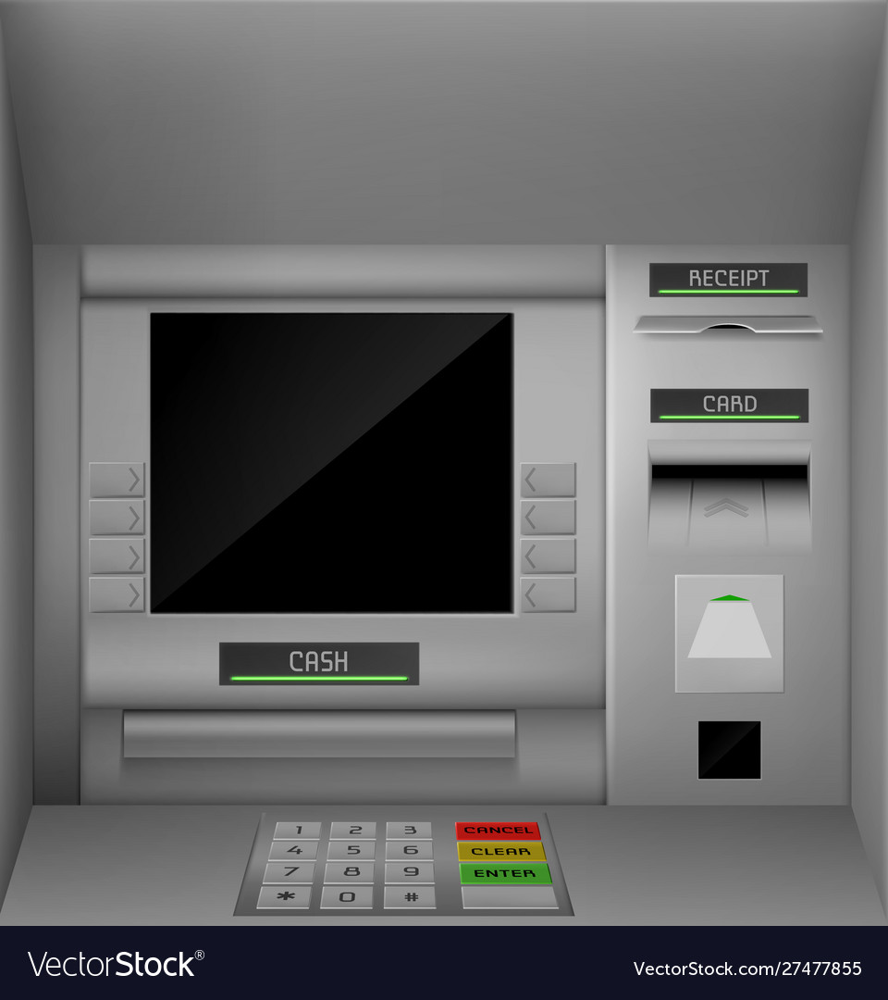

# 🏦 Bank Management System

The **Bank Management System** is a Java-based application that allows users to perform essential banking operations like account creation, deposits, withdrawals, balance inquiry, and more. This project uses **JDBC** to connect to a MySQL database and utilizes the **AWT** and **Swing** frameworks for its graphical user interface. The application was developed using **NetBeans IDE**.

---

## ✨ Features
1. 🔐 **User Authentication**:
   - Secure login system for users.
2. 📝 **Account Creation**:
   - Multi-step signup process to create a new bank account.
3. 💰 **Deposit & Withdrawals**:
   - Users can deposit and withdraw money from their accounts.
4. ⚡ **Fast Cash**:
   - Quick withdrawal of predefined amounts.
5. 📊 **Balance Inquiry**:
   - Check the current balance of your account.
6. 📜 **Mini Statement**:
   - View recent transactions of your account.
7. 🔑 **Pin Change**:
   - Securely update your account PIN.
8. 🧾 **Transaction History**:
   - Comprehensive view of past account transactions.

---

## 🛠️ Technology Stack

### Backend
- **Java** (JDK 19)
- **JDBC** for database connectivity
- **MySQL Workbench** for database management

### Frontend
- **AWT** and **Swing** frameworks for GUI design

### IDE
- **NetBeans IDE**

---

## 🔧 Prerequisites
1. **Java Development Kit (JDK)** - Version 19 or higher.
2. **NetBeans IDE** - To run and test the project.
3. **MySQL Server & Workbench** - To manage the database.
4. **Required Libraries**:
   - `mysql-connector-j-8.4.0.jar` (for MySQL-JDBC connection)
   - `jcalendar-tz-1.3.3-4.jar` (for date picker functionality)

---

## 🗂️ Database Schema
The project uses a MySQL database to store user information, account details, and transactions. Below is the schema outline:

### Tables
1. **Users**:
   - `id` (Primary Key)
   - `name`
   - `email`
   - `phone`
   - `address`
   - `account_no`
   - `pin`
   - `balance`

2. **Transactions**:
   - `transaction_id` (Primary Key)
   - `account_no`
   - `transaction_type` (Deposit/Withdrawal)
   - `amount`
   - `date`

3. **MiniStatements**:
   - `statement_id` (Primary Key)
   - `account_no`
   - `description`
   - `amount`
   - `date`

---

## 🚀 How to Run the Project

### Step 1: Clone or Download the Project
Clone the repository or download the ZIP file and extract it on your machine.

### Step 2: Configure the Database
1. Open **MySQL Workbench** and create a database (e.g., `bank_system`).
2. Run the SQL script provided in the `database.sql` file to set up the required tables.

### Step 3: Import Project into NetBeans
1. Open NetBeans IDE.
2. Select `File` > `Open Project`.
3. Navigate to the project folder and open it.

### Step 4: Update Database Connection in `Conn.java`
Modify the `Conn.java` file to match your MySQL credentials:
```java
import java.sql.*;

public class Conn {
    Connection c;
    Statement s;
    
    public Conn() {
        try {
            Class.forName("com.mysql.cj.jdbc.Driver");
            c = DriverManager.getConnection("jdbc:mysql://localhost:3306/bank_system", "root", "your_password");
            s = c.createStatement();
        } catch (Exception e) {
            e.printStackTrace();
        }
    }
}
```

### Step 5: Build and Run
1. Compile the project using the NetBeans build tools.
2. Run the application and use the GUI to interact with the system.

---

## 📸 Screenshots
### Login Screen


### Main Menu


---

## 📁 Project Structure
```
Bank Management System
├── src
│   ├── bank.management.system
│   │   ├── BalanceEnquiry.java
│   │   ├── Conn.java
│   │   ├── Deposit.java
│   │   ├── FastCash.java
│   │   ├── Login.java
│   │   ├── MiniStatement.java
│   │   ├── PinChange.java
│   │   ├── SignupOne.java
│   │   ├── SignupTwo.java
│   │   ├── SignupThree.java
│   │   ├── Transactions.java
│   │   ├── Withdrawl.java
│   ├── icons
│       ├── atm.jpg
│       ├── logo.jpg
├── lib
│   ├── mysql-connector-j-8.4.0.jar
│   ├── jcalendar-tz-1.3.3-4.jar
```

---

## 🛠️ Future Improvements
1. Add features like **Online Fund Transfer** and **Bill Payment**.
2. Enhance the GUI for a modern and responsive design.
3. Implement a role-based system for Admin and Customer functionalities.
4. Improve error handling and validation.

---

## 📜 License
This project is for educational purposes and does not include a license. Feel free to explore and modify it for learning.

---

## 👨‍💻 Author
Developed by **Sachin Pundir**.
